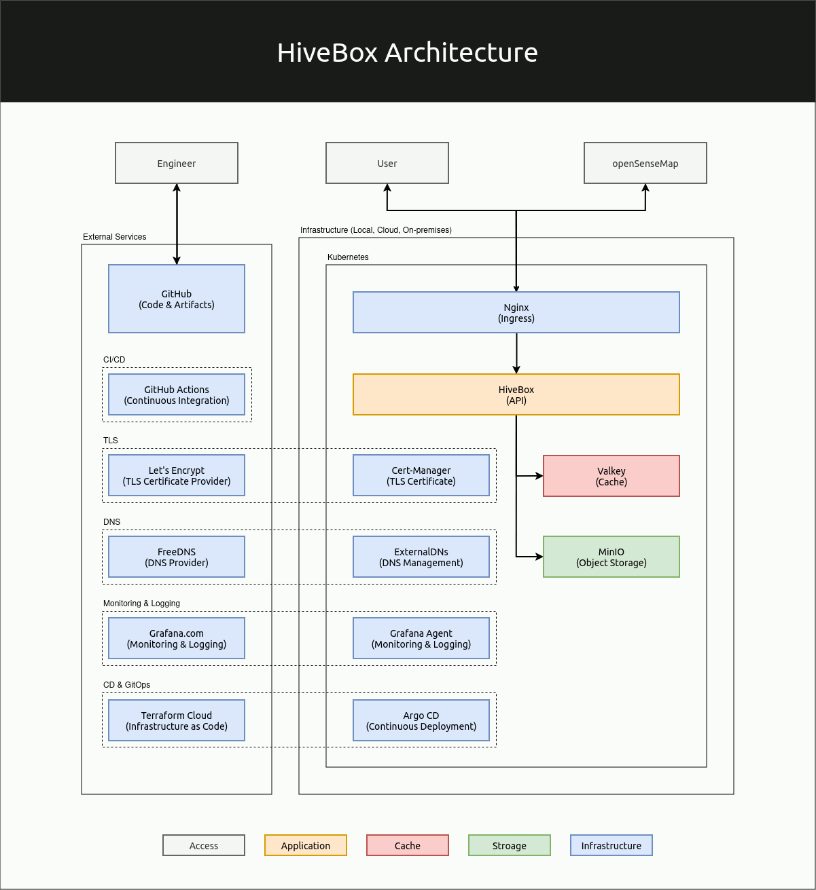

# HiveBoxProject
In this DevOps end-to-end hands-on project, we will utilize the technology and open-source software to build an API to track the environmental sensor data from openSenseMap, a platform for open sensor data in which everyone can participate.

In this project, you will cover many topics:

- Software Production.
- Agile Planning.
- QA and Quality Gates.
- Code and Programming.
- Operating System.
- Docker Containers.
- Kubernetes and Cloud.
- Observability and Monitoring.
- Continuous Integration/Delivery/Deployment.
- Automation and Infrastructure as Code.
--- 
## Goal 

